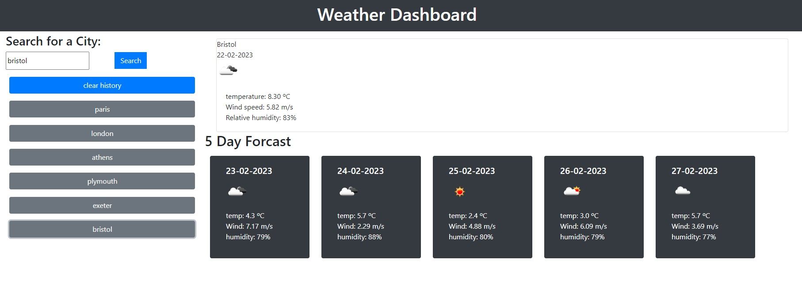

Weather Dashboard Challenge
## Description

The idea behind this app is to be able to collect and display weather data from an API based on the entered name of a location. 
This project involed creating a working interface that could collect and save location data using local storage. 

## Table of Contents (Optional)

N/A single page 

## Installation

Web page

## Usage

Enter a city in the search bar to find the weather for that location. Saved locations will appear as buttons which can then be clicked to check the weather for that location. 
Screenshot of theworking app: 
 

## Credits

Thanks to open weather API for the weater data. 

## License

MIT

